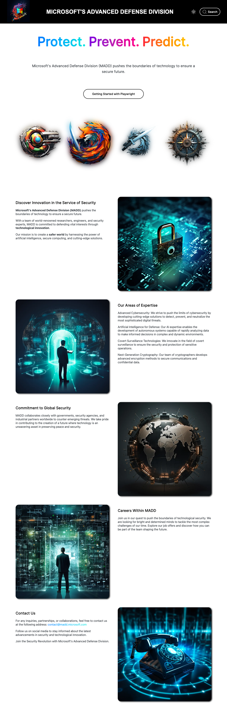
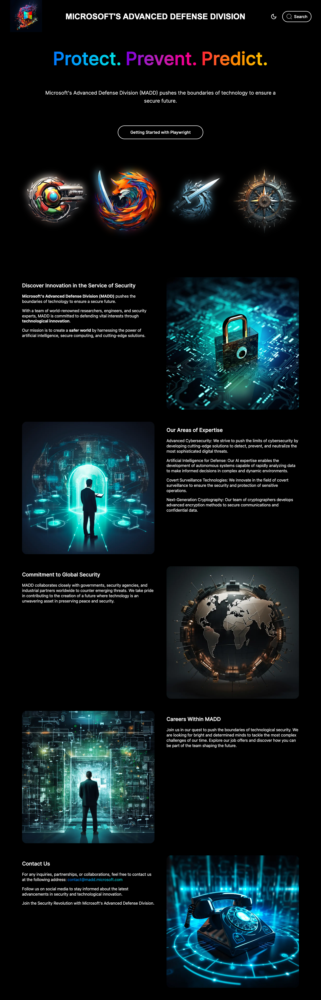

# Étape 2 - Désassemblage 💥

Notre service de renseignement vient de trouver [l'origine des activités](https://playwright-site-madd.vercel.app/) de nos enemies !

Votre mission, si vous l'acceptez, est de retourner son arme contre lui.

🎯 L'objectif ici est de découvrir l'API de playwright sans s'occuper des tests.

## Se rendre sur playwright dev

- Ouvrez le fichier `src/chapter_2.ts` qui nous servira de script.

- Dans ce fichier, importez playwright et dans une fonction asynchrone, lancez un chromium et stockez l'instance dans une variable [`browser`](https://playwright.dev/docs/api/class-browser).

<Solution>

```typescript
import playwright from 'playwright';

const run = async () => {
  const browser = await playwright.chromium.launch();
};

run();
```

</Solution>

- À partir de ce `browser`, créez une nouvelle page et stockez-la dans une variable `page`.

<Solution>

```typescript
const page = await browser.newPage();
```

</Solution>

- Faites naviguer votre page sur `https://playwright-site-madd.vercel.app/`.

<Solution>

```typescript
await page.goto('https://playwright-site-madd.vercel.app/');
```

</Solution>

- Affichez dans le terminal, la valeur du `title` de cette page.

<Solution>

```typescript
console.log(await page.title());
```

</Solution>

- Fermez le navigateur pour que le programme se termine

<Solution>

```typescript
await browser.close();
```

</Solution>

- Exécutez votre script

```shell
pnpm tsx src/chapter_2.ts
# OR
yarn tsx src/chapter_2.ts
# OR
npm exec src/chapter_2.ts
```

Vous devriez obtenir

```
Welcome to the official website of Microsoft's Advanced Defense Division | Security X technology
```

::: tip INFO
Pensez à fermer vos pages et vos navigateurs, pour que le programme se termine.
:::

- Modifiez votre script pour lancer le navigateur visuellement, c'est-à-dire sans mode headless.

<Solution>

```typescript
const browser = await playwright.chromium.launch({
  headless: false,
});
```

</Solution>

## Screenshot

- Faites un [screenshot](https://playwright.dev/docs/screenshots) de la page entière dans `src/screenshots/homepage.png`.

<Solution>

```typescript
await page.screenshot({
  path: `src/screenshot/homepage.png`,
  fullPage: true,
});
```

</Solution>

<Solution title="Résultat attendu">



</Solution>

- Configurez votre page pour avoir une préférence pour le dark mode grâce à l'API [`emulateMedia`](https://playwright.dev/docs/api/class-page#page-emulate-media) et refaites un screenshot dans `src/screenshots/homepage_dark.png`

<Solution>

```typescript
await page.emulateMedia({
  colorScheme: 'dark',
});

await page.screenshot({
  path: `src/screenshot/homepage_dark.png`,
  fullPage: true,
});
```

</Solution>

<Solution title="Résultat attendu">



</Solution>

## Multi-navigateur

Une des puissances de playwright réside dans son support de plusieurs navigateurs comme `chromium`, `firefox` et `webkit`.

::: tip INFO
Playwright possède également un support expérimental d'[Android](https://playwright.dev/docs/api/class-android/) et d'[Electron](https://playwright.dev/docs/api/class-electron).
:::

- Modifiez votre programme pour qu'il exécute ce code également avec firefox. Vous pourriez par exemple passer un paramètre à la fonction `run`

::: tip INFO
Vous pouvez récupérer le nom du navigateur avec la commande suivante, ce qui peut vous être utile pour avoir des screenshots par navigateur

```typescript
const browserTypeName = (await browser.browserType()).name();
```

:::

<Solution>

```typescript
const run = async (browserType: 'firefox' | 'chromium') => {
  const browser = await playwright[browserType].launch();
};
Promise.all([run('chromium'), run('firefox')]);
```

</Solution>

- Mettez à jour les path des screenshots pour qu'ils incluent le type de device

<Solution>

```typescript
await page.screenshot({
  path: `src/screenshot/${browserType}_homepage.png`,
  fullPage: true,
});

await page.screenshot({
  path: `src/screenshot/${browserType}_homepage_dark.png`,
  fullPage: true,
});
```

</Solution>

- Modifier votre script pour que les tests des différents navigateurs soient fait avec une émulation d'un `Pixel 4`. Pas d'inquiétude, il est déjà préconfiguré dans [`playwright.devices`](https://playwright.dev/docs/api/class-playwright#playwright-devices)

:::warning ATTENTION
Les `devices` définissent une propriété `isMobile` qui n'est pas compatible avec `firefox`.
:::

<Solution>

```typescript
const contextOption: playwright.BrowserContextOptions = {
  ...playwright.devices['Pixel 4'],
};
if (browserType === 'firefox') {
  contextOption.isMobile = false;
}
const mobileContext = await browser.newContext(contextOption);
const page = await mobileContext.newPage();
```

</Solution>

Nos agents nous informent que la seconde phrase qui vous permettra de décoder les codes secrets de Microsoft est le titre de la page que vous avez affiché dans votre terminal.

**Notez-la précieusement** dans `src/passphrases.txt` et vous pouvez passer à la phase 3 du plan !
